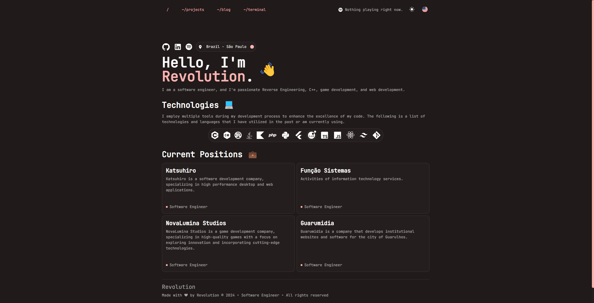

# Revolution Portfolio


A modern and interactive portfolio built with cutting-edge technology. This project demonstrates my skills and projects, highlighting my experience in full-stack development.



## ✨ Features

- **Responsive Design**: Perfect adaptation for any device
- **Light/Dark Theme**: Theme system for better user experience
- **Internationalization**: Support for multiple languages (Portuguese and English)
- **Interactive Terminal**: A simulated terminal for unique site interaction
- **Admin Dashboard**: Administrative panel to manage blog content
- **API Integration**: Integration with GitHub to display projects and Spotify to show current music
- **Rust Backend**: Robust API built with Rust and Axum
- **PostgreSQL Database**: Efficient storage for posts and users
- **Smooth Animations**: Transitions and animations using Framer Motion

## 🛠️ Technologies

### Frontend
- [Next.js 15](https://nextjs.org/)
- [TypeScript](https://www.typescriptlang.org/)
- [Material UI v6](https://mui.com/)
- [TailwindCSS](https://tailwindcss.com/)
- [Redux Toolkit](https://redux-toolkit.js.org/)
- [Framer Motion](https://www.framer.com/motion/)
- [React Hook Form](https://react-hook-form.com/)
- [Next Intl](https://next-intl-docs.vercel.app/)
- [Next Auth](https://next-auth.js.org/)

### Backend
- [Rust](https://www.rust-lang.org/)
- [Axum](https://github.com/tokio-rs/axum)
- [SQLx](https://github.com/launchbadge/sqlx)
- [PostgreSQL](https://www.postgresql.org/)
- [Shuttle](https://www.shuttle.rs/)

### Development Tools
- [Bun](https://bun.sh/)
- [Biome](https://biomejs.dev/)
- [Jest](https://jestjs.io/)
- [Playwright](https://playwright.dev/)
- [Husky](https://typicode.github.io/husky/#/)

## 🚀 Quick Start

### Prerequisites

- Node.js (version 18 or higher)
- Bun (optional, but recommended)
- Rust (for the backend)
- PostgreSQL

### Installation

1. Clone the repository:
```bash
git clone https://github.com/irevolutiondev/portfolio.git
cd portfolio
```

2. Install dependencies:
```bash
bun install
# or
npm install
```

3. Configure environment variables:
   Create a `.env.local` file in the project root based on `.env.example`

4. Run the frontend:
```bash
bun run dev
# or
npm run dev
```

5. Configure and run the backend:
```bash
cd backend
cargo shuttle run
```

## 📋 Available Scripts

- `dev`: Start the Next.js development server
- `build`: Build the project for production
- `start`: Start the production server
- `lint:next`: Run Next.js linter
- `run`: Start all services (Next.js, Vercel CLI, Backend)
- `format`: Format code with Biome
- `lint`: Run linter with Biome
- `check`: Check and fix code issues
- `test`: Run tests with Jest
- `e2e:headless`: Run end-to-end tests with Playwright
- `e2e:ui`: Run end-to-end tests with UI

## 📁 Project Structure

```
src/
├── @types/        # TypeScript type definitions
├── app/           # Application pages (Next.js App Router)
├── components/    # Reusable components
├── constants/     # Constants and configurations
├── features/      # Specific features
├── helpers/       # Helper functions
├── hooks/         # Custom React hooks
├── i18n/          # Internationalization configurations
├── lib/           # Libraries and utilities
├── providers/     # Context providers
├── redux/         # Global state management
├── templates/     # Templates and layouts
├── theme/         # Theme configurations
backend/
├── migrations/    # Database migrations
├── src/           # Rust backend source code
    ├── domain/    # Business logic
    ├── handlers/  # Request handlers
    ├── infra/     # Infrastructure and configurations
    └── utils/     # Utilities
```

## 🌐 Main Pages

- **Home**: Personal presentation and technologies
- **Projects**: Display of GitHub projects
- **Blog**: Articles and posts
- **Terminal**: Interactive terminal interface
- **Dashboard**: Administrative area to manage content

## 📱 Responsive Features

The portfolio is fully responsive, with specific layouts for:
- Desktop
- Tablet
- Mobile devices

## 🧪 Testing

Run unit tests:
```bash
bun test
# or
npm test
```

Run end-to-end tests:
```bash
bun run e2e:headless
# or
npm run e2e:headless
```

## 🔗 Deployment

This project is configured for deployment on Vercel. The Rust backend is hosted through Shuttle.rs.

## 👤 Author

**Revolution**
- GitHub: [@irevolutiondev](https://github.com/irevolutiondev)
- LinkedIn: [Revolution](https://www.linkedin.com/in/revolutionxk/)
- Spotify: [Revolution](https://open.spotify.com/user/jcm4iped0mnqusg2cvq5hy26z)
